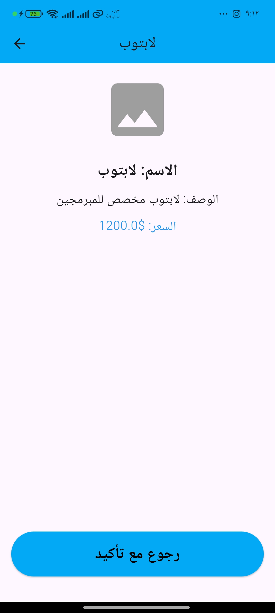

# حل تكليف المحاضرة الخامسة (التنقل وتمرير البيانات)

## 🔸 التمرين الأول: Basic Stack Navigation
شرح آليات التنقل البسيط باستخدام Push و Pop بين الشاشة الرئيسية وشاشة التفاصيل.

## 🔸 التمرين الثاني: Passing and Returning Data
شرح عملية تمرير كائن (Product Object) إلى شاشة التفاصيل، وإرجاع رسالة تأكيد ليتم عرضها في SnackBar.

### قائمة المنتجات وتمرير البيانات

### شاشة تفاصيل المنتج المستلمة للبيانات

### إرجاع البيانات وعرض الـ SnackBar

